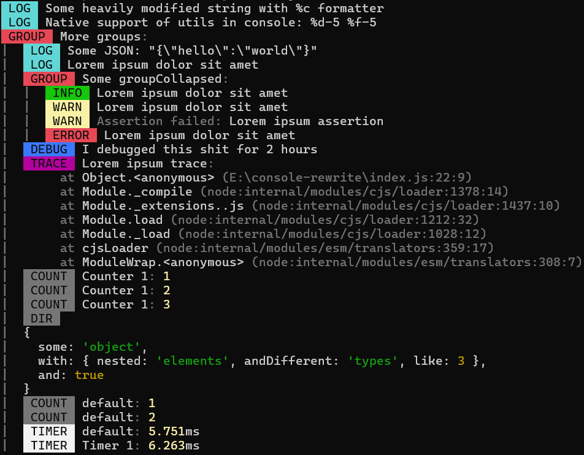

<p align="center">
  
</p>

| Before                         | After                         |
| ------------------------------ | ----------------------------- |
|  |  |

# Overview

Cuta is a tiny drop-in console enhancement.

# Install

```bash
$ npm install cuta
$ yarn add cuta
$ pnpm add cuta
```

> [!WARNING]
> Cuta doesn't support browser API & Bun at the moment!

# Usage

Cuta can be imported/used in different ways:

## Via CLI

Use the import flag

```sh
$ node --import=cuta index.js # ESM
$ npm run start --import=cuta
$ node --require=cuta index.js # CJS
$ npm run start --require=cuta
```

## Via code

In your executable main file prepend following line:

```js
import "cuta";
// or
require("cuta");
```

> [!NOTE]
> There's no programmatic API configuration for Cuta.

# Documentation

Prototype overwrite mirrors native NodeJS [implementation of console](https://nodejs.org/api/console.html). Feel free to open an issue for further questions.

# License

This project is under [MIT](https://choosealicense.com/licenses/mit/) license. You can freely use it for your own purposes.
